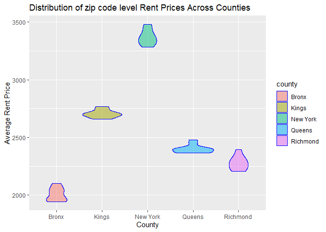

Untitled
================
2025-10-02

``` r
library(tidyverse)
```

    ## ── Attaching core tidyverse packages ──────────────────────── tidyverse 2.0.0 ──
    ## ✔ dplyr     1.1.4     ✔ readr     2.1.5
    ## ✔ forcats   1.0.0     ✔ stringr   1.5.1
    ## ✔ ggplot2   3.5.2     ✔ tibble    3.3.0
    ## ✔ lubridate 1.9.4     ✔ tidyr     1.3.1
    ## ✔ purrr     1.1.0     
    ## ── Conflicts ────────────────────────────────────────── tidyverse_conflicts() ──
    ## ✖ dplyr::filter() masks stats::filter()
    ## ✖ dplyr::lag()    masks stats::lag()
    ## ℹ Use the conflicted package (<http://conflicted.r-lib.org/>) to force all conflicts to become errors

``` r
library(patchwork)
library(readxl)
library(p8105.datasets)
data("instacart")
```

# Problem 1

## How many aisles are there, and which aisles are the most items ordered from?

``` r
instacart |>
  count(aisle_id) |>
  nrow()
```

    ## [1] 134

``` r
instacart |>
  count(aisle,name = "items_ordered") |>
  filter(min_rank(desc(items_ordered)) < 2)
```

    ## # A tibble: 1 × 2
    ##   aisle            items_ordered
    ##   <chr>                    <int>
    ## 1 fresh vegetables        150609

## The number of items ordered in each aisle(more than 10000)

``` r
items_ordered_by_aisles =
instacart |>
  count(aisle,name = "items_ordered") |>
  filter(items_ordered >= 10000)
items_ordered_by_aisles
```

    ## # A tibble: 39 × 2
    ##    aisle                    items_ordered
    ##    <chr>                            <int>
    ##  1 baby food formula                13198
    ##  2 baking ingredients               13088
    ##  3 bread                            23635
    ##  4 butter                           10575
    ##  5 candy chocolate                  11453
    ##  6 canned jarred vegetables         12679
    ##  7 canned meals beans               11774
    ##  8 cereal                           16201
    ##  9 chips pretzels                   31269
    ## 10 crackers                         19592
    ## # ℹ 29 more rows

``` r
  ggplot(items_ordered_by_aisles,aes(x = fct_reorder(aisle, items_ordered),y = items_ordered)) +
  geom_col() +
  coord_flip() +
  labs(
    title = "Number of Items from every Aisles(above 10000 orders)",
    x = "aisles",
    y = "number of items ordered"
  )
```

<!-- -->

## The three most popular items in each of the aisles

``` r
popular_items =
  instacart |>
  filter(aisle %in% c("baking ingredients", "dog food care", "packaged vegetables fruits")) |>
  group_by(aisle) |>
  count(product_name,name = "items_ordered") |>
  filter(min_rank(desc(items_ordered)) < 4)

knitr::kable(
  popular_items,
  col.names = c("Aisle", "Product Name", "Times Ordered")
)
```

| Aisle | Product Name | Times Ordered |
|:---|:---|---:|
| baking ingredients | Cane Sugar | 336 |
| baking ingredients | Light Brown Sugar | 499 |
| baking ingredients | Pure Baking Soda | 387 |
| dog food care | Organix Chicken & Brown Rice Recipe | 28 |
| dog food care | Small Dog Biscuits | 26 |
| dog food care | Snack Sticks Chicken & Rice Recipe Dog Treats | 30 |
| packaged vegetables fruits | Organic Baby Spinach | 9784 |
| packaged vegetables fruits | Organic Blueberries | 4966 |
| packaged vegetables fruits | Organic Raspberries | 5546 |

## 2x7 table about pink lady apples and coffee ice cream

``` r
instacart |>
  filter(product_name %in% c("Pink Lady Apples","Coffee Ice Cream")) |>
  group_by(product_name,order_dow) |>
  summarize(mean_ordered_hour = mean(order_hour_of_day)) |>
  select(product_name,order_dow,mean_ordered_hour) |>
  pivot_wider(
    names_from = order_dow,
    values_from = mean_ordered_hour
  ) |>
knitr::kable(
  digits = 1,
  col.names = c("Product", "Sun", "Mon", "Tue", "Wed", "Thu", "Fri", "Sat"))
```

    ## `summarise()` has grouped output by 'product_name'. You can override using the
    ## `.groups` argument.

| Product          |  Sun |  Mon |  Tue |  Wed |  Thu |  Fri |  Sat |
|:-----------------|-----:|-----:|-----:|-----:|-----:|-----:|-----:|
| Coffee Ice Cream | 13.8 | 14.3 | 15.4 | 15.3 | 15.2 | 12.3 | 13.8 |
| Pink Lady Apples | 13.4 | 11.4 | 11.7 | 14.2 | 11.6 | 12.8 | 11.9 |

# Problem 2

## zip codes dataset

``` r
zip_codes = 
  read_csv(
    "./zillow_data/Zip Codes.csv",
    na = c("NA", "", ".")
  ) |>
  janitor::clean_names() |>
  separate(file_date, into = c("month","day","year"), sep = "/", convert = TRUE) |>
  select(-state_fips,-county_code) |>
  mutate(
    zip_code = str_pad(as.character(zip_code), width = 5, pad = "0"),
    year = if_else(nchar(as.character(year)) == 2, paste0("20", year), as.character(year)), 
    date = make_date(as.integer(year), as.integer(month), as.integer(day))
  ) |>
  arrange(zip_code, date) |>
  select(county, zip_code, year, month, day, date, everything())
```

    ## Rows: 322 Columns: 7
    ## ── Column specification ────────────────────────────────────────────────────────
    ## Delimiter: ","
    ## chr (4): County, County Code, File Date, Neighborhood
    ## dbl (3): State FIPS, County FIPS, ZipCode
    ## 
    ## ℹ Use `spec()` to retrieve the full column specification for this data.
    ## ℹ Specify the column types or set `show_col_types = FALSE` to quiet this message.

``` r
zip_codes
```

    ## # A tibble: 322 × 8
    ##    county   zip_code year  month   day date       county_fips neighborhood      
    ##    <chr>    <chr>    <chr> <int> <int> <date>           <dbl> <chr>             
    ##  1 New York 10001    7         7    25 0007-07-25       36061 Chelsea and Clint…
    ##  2 New York 10002    7         7    25 0007-07-25       36061 Lower East Side   
    ##  3 New York 10003    7         7    25 0007-07-25       36061 Lower East Side   
    ##  4 New York 10004    7         7    25 0007-07-25       36061 Lower Manhattan   
    ##  5 New York 10005    7         7    25 0007-07-25       36061 Lower Manhattan   
    ##  6 New York 10006    7         7    25 0007-07-25       36061 Lower Manhattan   
    ##  7 New York 10007    7         7    25 0007-07-25       36061 Lower Manhattan   
    ##  8 New York 10008    7         7    25 0007-07-25       36061 <NA>              
    ##  9 New York 10009    7         7    25 0007-07-25       36061 Lower East Side   
    ## 10 New York 10010    7         7    25 0007-07-25       36061 Gramercy Park and…
    ## # ℹ 312 more rows

## zori dataset

``` r
zori = 
  read_csv(
    "./zillow_data/Zip_zori_uc_sfrcondomfr_sm_month_NYC.csv",
    na = c("NA", "", ".")
  ) |>
  janitor::clean_names() |>
  rename(zip_code = region_name, county = county_name) |>
  mutate(zip_code = str_pad(as.character(zip_code), width = 5, pad = "0"))
```

    ## Rows: 149 Columns: 125
    ## ── Column specification ────────────────────────────────────────────────────────
    ## Delimiter: ","
    ## chr   (6): RegionType, StateName, State, City, Metro, CountyName
    ## dbl (119): RegionID, SizeRank, RegionName, 2015-01-31, 2015-02-28, 2015-03-3...
    ## 
    ## ℹ Use `spec()` to retrieve the full column specification for this data.
    ## ℹ Specify the column types or set `show_col_types = FALSE` to quiet this message.

``` r
zori
```

    ## # A tibble: 149 × 125
    ##    region_id size_rank zip_code region_type state_name state city   metro county
    ##        <dbl>     <dbl> <chr>    <chr>       <chr>      <chr> <chr>  <chr> <chr> 
    ##  1     62080         4 11368    zip         NY         NY    New Y… New … Queen…
    ##  2     62093         7 11385    zip         NY         NY    New Y… New … Queen…
    ##  3     62019         9 11208    zip         NY         NY    New Y… New … Kings…
    ##  4     62046        16 11236    zip         NY         NY    New Y… New … Kings…
    ##  5     61807        17 10467    zip         NY         NY    New Y… New … Bronx…
    ##  6     62085        18 11373    zip         NY         NY    New Y… New … Queen…
    ##  7     62037        19 11226    zip         NY         NY    New Y… New … Kings…
    ##  8     62018        20 11207    zip         NY         NY    New Y… New … Kings…
    ##  9     61639        29 10025    zip         NY         NY    New Y… New … New Y…
    ## 10     62025        32 11214    zip         NY         NY    New Y… New … Kings…
    ## # ℹ 139 more rows
    ## # ℹ 116 more variables: x2015_01_31 <dbl>, x2015_02_28 <dbl>,
    ## #   x2015_03_31 <dbl>, x2015_04_30 <dbl>, x2015_05_31 <dbl>, x2015_06_30 <dbl>,
    ## #   x2015_07_31 <dbl>, x2015_08_31 <dbl>, x2015_09_30 <dbl>, x2015_10_31 <dbl>,
    ## #   x2015_11_30 <dbl>, x2015_12_31 <dbl>, x2016_01_31 <dbl>, x2016_02_29 <dbl>,
    ## #   x2016_03_31 <dbl>, x2016_04_30 <dbl>, x2016_05_31 <dbl>, x2016_06_30 <dbl>,
    ## #   x2016_07_31 <dbl>, x2016_08_31 <dbl>, x2016_09_30 <dbl>, …

## zori rent price dataset

``` r
zori_rent_price =
  zori |>
  mutate(county = str_remove(county, " County")) |>
  pivot_longer(
    cols = starts_with("x"),
    names_to = "date_raw", 
    values_to = "rent_price",
    names_prefix = "x"
  ) |>
  filter(!is.na(rent_price)) |>
  separate(date_raw, into = c("year","month","day"), sep = "_", convert = TRUE) |>
  mutate(
    date = make_date(year, month, day),
    rent_price = as.numeric(rent_price),
    zip_code = as.character(zip_code)
  ) |>
  arrange(zip_code, date) |>
  select(county, zip_code, year, month, day, date, rent_price, everything())
zori_rent_price
```

    ## # A tibble: 10,450 × 14
    ##    county   zip_code  year month   day date       rent_price region_id size_rank
    ##    <chr>    <chr>    <int> <int> <int> <date>          <dbl>     <dbl>     <dbl>
    ##  1 New York 10001     2015     1    31 2015-01-31      3855.     61615      4444
    ##  2 New York 10001     2015     2    28 2015-02-28      3892.     61615      4444
    ##  3 New York 10001     2015     3    31 2015-03-31      3898.     61615      4444
    ##  4 New York 10001     2015     4    30 2015-04-30      3970.     61615      4444
    ##  5 New York 10001     2015     5    31 2015-05-31      4033.     61615      4444
    ##  6 New York 10001     2015     6    30 2015-06-30      4071.     61615      4444
    ##  7 New York 10001     2015     7    31 2015-07-31      4067.     61615      4444
    ##  8 New York 10001     2015     8    31 2015-08-31      4070.     61615      4444
    ##  9 New York 10001     2015     9    30 2015-09-30      4040.     61615      4444
    ## 10 New York 10001     2015    10    31 2015-10-31      4023.     61615      4444
    ## # ℹ 10,440 more rows
    ## # ℹ 5 more variables: region_type <chr>, state_name <chr>, state <chr>,
    ## #   city <chr>, metro <chr>

## merge two datasets

``` r
zillow_merged = 
  full_join(
    zip_codes |>
      mutate(across(c(year, month, day), as.integer)),
    zori_rent_price |>
      mutate(across(c(year, month, day), as.integer)),
    by = c("zip_code","county","year","month","day")
  ) |>
  drop_na(rent_price)
zillow_merged
```

    ## # A tibble: 10,450 × 17
    ##    county   zip_code  year month   day date.x county_fips neighborhood
    ##    <chr>    <chr>    <int> <int> <int> <date>       <dbl> <chr>       
    ##  1 New York 10001     2015     1    31 NA              NA <NA>        
    ##  2 New York 10001     2015     2    28 NA              NA <NA>        
    ##  3 New York 10001     2015     3    31 NA              NA <NA>        
    ##  4 New York 10001     2015     4    30 NA              NA <NA>        
    ##  5 New York 10001     2015     5    31 NA              NA <NA>        
    ##  6 New York 10001     2015     6    30 NA              NA <NA>        
    ##  7 New York 10001     2015     7    31 NA              NA <NA>        
    ##  8 New York 10001     2015     8    31 NA              NA <NA>        
    ##  9 New York 10001     2015     9    30 NA              NA <NA>        
    ## 10 New York 10001     2015    10    31 NA              NA <NA>        
    ## # ℹ 10,440 more rows
    ## # ℹ 9 more variables: date.y <date>, rent_price <dbl>, region_id <dbl>,
    ## #   size_rank <dbl>, region_type <chr>, state_name <chr>, state <chr>,
    ## #   city <chr>, metro <chr>

## zip codes observe times

``` r
zip_codes_obs_times =
  zillow_merged |>
  select(zip_code,year,month,county,rent_price) |>
  group_by(zip_code) |>
  count(zip_code)
zip_codes_obs_times
```

    ## # A tibble: 149 × 2
    ## # Groups:   zip_code [149]
    ##    zip_code     n
    ##    <chr>    <int>
    ##  1 10001      116
    ##  2 10002      116
    ##  3 10003      116
    ##  4 10004       92
    ##  5 10005      116
    ##  6 10006       52
    ##  7 10007       92
    ##  8 10009      114
    ##  9 10010      116
    ## 10 10011      114
    ## # ℹ 139 more rows

## zip codes observed 116 times

``` r
zip_codes_obs_times |>
  filter(n == 116) |>
  nrow()
```

    ## [1] 48

## zip codes observed less than 10 times

``` r
zip_codes_obs_times |>
  filter(n < 10) |>
  nrow()
```

    ## [1] 26

## description

Some zip codes appear only once because they are special-purpose codes,
such as 10041 (Wall Street) or 10101–10123, which are tied to office
towers, government buildings, or PO boxes with almost no residential
housing. Zillow collects housing data, so these areas rarely generate
rental records. By contrast, residential ZIP codes like 10025 (Upper
West Side) or 11201 (Brooklyn Heights) contain thousands of apartments
and homes, producing rental listings every month. As a result, they
appear in the dataset almost continuously, with very high `n` values
compared to the special-purpose ZIP codes.

## table showing the average rental price in each borough and year

``` r
price_borough_year_table =
  zillow_merged |>
    group_by(county,year) |>
  summarize(avg_rent_price = mean(rent_price,na.rm = TRUE),.groups = "drop") |>
  select(county,year,avg_rent_price) |>
  pivot_wider(
    names_from = year,
    values_from = avg_rent_price
  )
  
  knitr::kable(
  price_borough_year_table,
  digits = 3,
  col.names = c("County","2015","2016","2017","2018","2019","2020","2021","2022","2023","2024")
)
```

| County | 2015 | 2016 | 2017 | 2018 | 2019 | 2020 | 2021 | 2022 | 2023 | 2024 |
|:---|---:|---:|---:|---:|---:|---:|---:|---:|---:|---:|
| Bronx | 1759.595 | 1520.194 | 1543.599 | 1639.430 | 1705.589 | 1811.443 | 1857.777 | 2054.267 | 2285.459 | 2496.896 |
| Kings | 2492.928 | 2520.357 | 2545.828 | 2547.291 | 2630.504 | 2555.051 | 2549.890 | 2868.199 | 3015.184 | 3126.803 |
| New York | 3022.042 | 3038.818 | 3133.848 | 3183.703 | 3310.408 | 3106.517 | 3136.632 | 3778.375 | 3932.610 | 4078.440 |
| Queens | 2214.707 | 2271.955 | 2263.303 | 2291.918 | 2387.816 | 2315.632 | 2210.787 | 2406.038 | 2561.615 | 2694.022 |
| Richmond | NA | NA | NA | NA | NA | 1977.608 | 2045.430 | 2147.436 | 2332.934 | 2536.442 |

## Average Rent Price plot

``` r
avg_rent_price =
  zillow_merged |>
  group_by(county,year) |>
  summarize(avg_rent_price = mean(rent_price,na.rm = TRUE),.groups = "drop") |>
  select(county,year,avg_rent_price) |>
  ggplot(aes(x = year, y = avg_rent_price, color = county)) + 
  geom_smooth(se = FALSE) +
  labs(
    title = "Average Rent Price plot(2015-2024)",
    x = "Year",
    y = "Average Rent Price",
    color = "County") +
   scale_x_continuous(
    breaks = c(2015,2018,2021,2024), 
    labels = c("2015", "2018", "2021","2024"))
avg_rent_price
```

    ## `geom_smooth()` using method = 'loess' and formula = 'y ~ x'

    ## Warning in simpleLoess(y, x, w, span, degree = degree, parametric = parametric,
    ## : span too small.  fewer data values than degrees of freedom.

    ## Warning in simpleLoess(y, x, w, span, degree = degree, parametric = parametric,
    ## : pseudoinverse used at 2020

    ## Warning in simpleLoess(y, x, w, span, degree = degree, parametric = parametric,
    ## : neighborhood radius 2.02

    ## Warning in simpleLoess(y, x, w, span, degree = degree, parametric = parametric,
    ## : reciprocal condition number 0

    ## Warning in simpleLoess(y, x, w, span, degree = degree, parametric = parametric,
    ## : There are other near singularities as well. 4.0804

<!-- -->

## description

1.Overall trend: Most Boroughs experienced a steady rise in rents
between 2017 and 2019, followed by varying degrees of decline in 2020
due to the pandemic. 2.New York: The highest overall rental level, but
it declined significantly from 2020 to 2021, followed by a gradual
recovery. 2.Kings: The upward trend continues, but with less volatility
than Manhattan. 3.Queens: Rent levels are slightly lower than in
Brooklyn, with an overall relatively stable curve. 4.Bronx and Richmond:
The lowest rental levels, but with slow growth

## Average rental price within each zip code over each month in 2023

``` r
zillow_merged |>
  filter(year == 2023) |>
  group_by(zip_code,month) |>
  summarize(avg_rent_price = mean(rent_price,na.rm = TRUE),.groups = "drop") |>
  select(zip_code,month,avg_rent_price)
```

    ## # A tibble: 1,455 × 3
    ##    zip_code month avg_rent_price
    ##    <chr>    <int>          <dbl>
    ##  1 10001        1          4672.
    ##  2 10001        2          4692.
    ##  3 10001        3          4750.
    ##  4 10001        4          4842.
    ##  5 10001        5          4903.
    ##  6 10001        6          4992.
    ##  7 10001        7          5053.
    ##  8 10001        8          5112.
    ##  9 10001        9          5097.
    ## 10 10001       10          5023.
    ## # ℹ 1,445 more rows

## Distribution of zip code level rent prices across counties

``` r
dist_of_zip_across_county =
  zillow_merged |>
  group_by(county,month) |>
  summarize(avg_rent_price = mean(rent_price,na.rm = TRUE),.groups = "drop") |>
  select(county,month,avg_rent_price) |>
  ggplot(aes(x = county, y = avg_rent_price, fill = county)) +
  geom_violin(aes(fill = county),color = "blue",alpha = .5) +
  labs(title = "Distribution of zip code level Rent Prices Across Counties",
       x = "County",
       y = "Average Rent Price") 
dist_of_zip_across_county
```

<!-- -->

\##combined plot

``` r
avg_rent_price / dist_of_zip_across_county
```

    ## `geom_smooth()` using method = 'loess' and formula = 'y ~ x'

    ## Warning in simpleLoess(y, x, w, span, degree = degree, parametric = parametric,
    ## : span too small.  fewer data values than degrees of freedom.

    ## Warning in simpleLoess(y, x, w, span, degree = degree, parametric = parametric,
    ## : pseudoinverse used at 2020

    ## Warning in simpleLoess(y, x, w, span, degree = degree, parametric = parametric,
    ## : neighborhood radius 2.02

    ## Warning in simpleLoess(y, x, w, span, degree = degree, parametric = parametric,
    ## : reciprocal condition number 0

    ## Warning in simpleLoess(y, x, w, span, degree = degree, parametric = parametric,
    ## : There are other near singularities as well. 4.0804

<!-- -->

# Problem 3

## nhanes_accel

``` r
nhanes_accel = 
  read_csv(
    "./nhanes_accel.csv",
    na = c("NA", "", ".")
  ) |>
  janitor::clean_names() 
```

    ## Rows: 250 Columns: 1441
    ## ── Column specification ────────────────────────────────────────────────────────
    ## Delimiter: ","
    ## dbl (1441): SEQN, min1, min2, min3, min4, min5, min6, min7, min8, min9, min1...
    ## 
    ## ℹ Use `spec()` to retrieve the full column specification for this data.
    ## ℹ Specify the column types or set `show_col_types = FALSE` to quiet this message.

``` r
nhanes_accel
```

    ## # A tibble: 250 × 1,441
    ##     seqn  min1  min2  min3  min4   min5   min6  min7   min8    min9  min10
    ##    <dbl> <dbl> <dbl> <dbl> <dbl>  <dbl>  <dbl> <dbl>  <dbl>   <dbl>  <dbl>
    ##  1 62161 1.11  3.12  1.47  0.938 1.60   0.145  2.10  0.509   1.63   1.20  
    ##  2 62164 1.92  1.67  2.38  0.935 2.59   5.22   2.39  4.90    1.97   3.13  
    ##  3 62169 5.85  5.18  4.76  6.48  6.85   7.24   6.12  7.48    5.47   6.49  
    ##  4 62174 5.42  3.48  3.72  3.81  6.85   4.45   0.561 1.61    0.698  2.72  
    ##  5 62177 6.14  8.06  9.99  6.60  4.57   2.78   7.10  7.25   10.1    7.49  
    ##  6 62178 0.167 0.429 0.131 1.20  0.0796 0.0487 0.106 0.0653  0.0564 0.0639
    ##  7 62180 0.039 0     0     0     0.369  0.265  0.506 0.638   0      0.011 
    ##  8 62184 1.55  2.81  3.86  4.76  6.10   7.61   4.74  6.73    5.42   4.24  
    ##  9 62186 3.08  2.54  2.63  2.12  1.14   1.68   2.84  2.72    2.13   2.18  
    ## 10 62189 2.81  0.195 0.163 0     0.144  0.180  0.870 0.214   0      0     
    ## # ℹ 240 more rows
    ## # ℹ 1,430 more variables: min11 <dbl>, min12 <dbl>, min13 <dbl>, min14 <dbl>,
    ## #   min15 <dbl>, min16 <dbl>, min17 <dbl>, min18 <dbl>, min19 <dbl>,
    ## #   min20 <dbl>, min21 <dbl>, min22 <dbl>, min23 <dbl>, min24 <dbl>,
    ## #   min25 <dbl>, min26 <dbl>, min27 <dbl>, min28 <dbl>, min29 <dbl>,
    ## #   min30 <dbl>, min31 <dbl>, min32 <dbl>, min33 <dbl>, min34 <dbl>,
    ## #   min35 <dbl>, min36 <dbl>, min37 <dbl>, min38 <dbl>, min39 <dbl>, …

## nhanes_covar

``` r
nhanes_covar = 
  read_csv(
    "./nhanes_covar.csv",
    na = c("NA", "", "."),
    skip = 4
  ) |>
  janitor::clean_names() 
```

    ## Rows: 250 Columns: 5
    ## ── Column specification ────────────────────────────────────────────────────────
    ## Delimiter: ","
    ## dbl (5): SEQN, sex, age, BMI, education
    ## 
    ## ℹ Use `spec()` to retrieve the full column specification for this data.
    ## ℹ Specify the column types or set `show_col_types = FALSE` to quiet this message.

``` r
nhanes_covar
```

    ## # A tibble: 250 × 5
    ##     seqn   sex   age   bmi education
    ##    <dbl> <dbl> <dbl> <dbl>     <dbl>
    ##  1 62161     1    22  23.3         2
    ##  2 62164     2    44  23.2         3
    ##  3 62169     1    21  20.1         2
    ##  4 62174     1    80  33.9         3
    ##  5 62177     1    51  20.1         2
    ##  6 62178     1    80  28.5         2
    ##  7 62180     1    35  27.9         3
    ##  8 62184     1    26  22.1         2
    ##  9 62186     2    17  22.9        NA
    ## 10 62189     2    30  22.4         3
    ## # ℹ 240 more rows

## merge two datasets

``` r
nhanes_merged = 
  full_join(nhanes_covar,nhanes_accel,by = "seqn")
nhanes_merged
```

    ## # A tibble: 250 × 1,445
    ##     seqn   sex   age   bmi education  min1  min2  min3  min4   min5   min6  min7
    ##    <dbl> <dbl> <dbl> <dbl>     <dbl> <dbl> <dbl> <dbl> <dbl>  <dbl>  <dbl> <dbl>
    ##  1 62161     1    22  23.3         2 1.11  3.12  1.47  0.938 1.60   0.145  2.10 
    ##  2 62164     2    44  23.2         3 1.92  1.67  2.38  0.935 2.59   5.22   2.39 
    ##  3 62169     1    21  20.1         2 5.85  5.18  4.76  6.48  6.85   7.24   6.12 
    ##  4 62174     1    80  33.9         3 5.42  3.48  3.72  3.81  6.85   4.45   0.561
    ##  5 62177     1    51  20.1         2 6.14  8.06  9.99  6.60  4.57   2.78   7.10 
    ##  6 62178     1    80  28.5         2 0.167 0.429 0.131 1.20  0.0796 0.0487 0.106
    ##  7 62180     1    35  27.9         3 0.039 0     0     0     0.369  0.265  0.506
    ##  8 62184     1    26  22.1         2 1.55  2.81  3.86  4.76  6.10   7.61   4.74 
    ##  9 62186     2    17  22.9        NA 3.08  2.54  2.63  2.12  1.14   1.68   2.84 
    ## 10 62189     2    30  22.4         3 2.81  0.195 0.163 0     0.144  0.180  0.870
    ## # ℹ 240 more rows
    ## # ℹ 1,433 more variables: min8 <dbl>, min9 <dbl>, min10 <dbl>, min11 <dbl>,
    ## #   min12 <dbl>, min13 <dbl>, min14 <dbl>, min15 <dbl>, min16 <dbl>,
    ## #   min17 <dbl>, min18 <dbl>, min19 <dbl>, min20 <dbl>, min21 <dbl>,
    ## #   min22 <dbl>, min23 <dbl>, min24 <dbl>, min25 <dbl>, min26 <dbl>,
    ## #   min27 <dbl>, min28 <dbl>, min29 <dbl>, min30 <dbl>, min31 <dbl>,
    ## #   min32 <dbl>, min33 <dbl>, min34 <dbl>, min35 <dbl>, min36 <dbl>, …

## tidy data

``` r
nhanes_tidy =
  nhanes_merged |>
  filter(age >= 21) |>
  mutate(
    sex = 
      case_match(
        sex, 
        1 ~ "male", 
        2 ~ "female"),
    sex = as.factor(sex)
  ) |>
  mutate(
    education = 
      case_match(
        education, 
        1 ~ "Less than high school",
        2 ~ "High school equivalent",
        3 ~ "More than high school"),
    education = as.factor(education),
    education = factor(education, 
                      levels = c("Less than high school", 
                                "High school equivalent", 
                                "More than high school"))
  ) |>
  drop_na()
nhanes_tidy
```

    ## # A tibble: 228 × 1,445
    ##     seqn sex      age   bmi education     min1   min2   min3  min4   min5   min6
    ##    <dbl> <fct>  <dbl> <dbl> <fct>        <dbl>  <dbl>  <dbl> <dbl>  <dbl>  <dbl>
    ##  1 62161 male      22  23.3 High school… 1.11  3.12   1.47   0.938 1.60   0.145 
    ##  2 62164 female    44  23.2 More than h… 1.92  1.67   2.38   0.935 2.59   5.22  
    ##  3 62169 male      21  20.1 High school… 5.85  5.18   4.76   6.48  6.85   7.24  
    ##  4 62174 male      80  33.9 More than h… 5.42  3.48   3.72   3.81  6.85   4.45  
    ##  5 62177 male      51  20.1 High school… 6.14  8.06   9.99   6.60  4.57   2.78  
    ##  6 62178 male      80  28.5 High school… 0.167 0.429  0.131  1.20  0.0796 0.0487
    ##  7 62180 male      35  27.9 More than h… 0.039 0      0      0     0.369  0.265 
    ##  8 62184 male      26  22.1 High school… 1.55  2.81   3.86   4.76  6.10   7.61  
    ##  9 62189 female    30  22.4 More than h… 2.81  0.195  0.163  0     0.144  0.180 
    ## 10 62199 male      57  28   More than h… 0.031 0.0359 0.0387 0.079 0.109  0.262 
    ## # ℹ 218 more rows
    ## # ℹ 1,434 more variables: min7 <dbl>, min8 <dbl>, min9 <dbl>, min10 <dbl>,
    ## #   min11 <dbl>, min12 <dbl>, min13 <dbl>, min14 <dbl>, min15 <dbl>,
    ## #   min16 <dbl>, min17 <dbl>, min18 <dbl>, min19 <dbl>, min20 <dbl>,
    ## #   min21 <dbl>, min22 <dbl>, min23 <dbl>, min24 <dbl>, min25 <dbl>,
    ## #   min26 <dbl>, min27 <dbl>, min28 <dbl>, min29 <dbl>, min30 <dbl>,
    ## #   min31 <dbl>, min32 <dbl>, min33 <dbl>, min34 <dbl>, min35 <dbl>, …

## sex_edu_dist

``` r
sex_edu_dist =
  nhanes_tidy |>
  select(sex,education) |>
  count(sex,education) |>
  pivot_wider(
    names_from = "education",
    values_from = "n"
  )
sex_edu_dist
```

    ## # A tibble: 2 × 4
    ##   sex    `Less than high school` `High school equivalent` More than high schoo…¹
    ##   <fct>                    <int>                    <int>                  <int>
    ## 1 female                      28                       23                     59
    ## 2 male                        27                       35                     56
    ## # ℹ abbreviated name: ¹​`More than high school`

## visualization

``` r
visual_age_sex =
  nhanes_tidy |>
  select(sex,age,education) |>
  ggplot(aes(x = sex, y = age, fill = sex)) +
  geom_violin(alpha = 0.7) +
  facet_wrap(~education) +
  labs(
    title = "Age-Sex distributions in 3 different education levels",
    x = "Sex",
    y = "Age") 
visual_age_sex
```

<!-- -->

## Comment

This chart effectively visualizes age-sex distributions across three
education categories using a population pyramid structure. The
horizontal axis represents population percentage, while the vertical
axis shows age cohorts.

Typically, the “Less than high school” category displays a wider top,
indicating an older demographic - reflecting historical educational
access limitations. Conversely, the “More than high school” group often
shows a broader base, representing younger, more educated cohorts.

The chart’s strength lies in revealing gender disparities in educational
attainment. For instance, in younger age groups (20-40) of the “More
than high school” category, the female side frequently shows longer
bars, visualizing higher female participation in tertiary education - a
notable contemporary trend. This visualization powerfully demonstrates
how educational levels correlate with fundamental demographic patterns,
offering valuable insights into social stratification and informing both
policy development and market analysis.

## total activity

``` r
nhanes_total =
  nhanes_tidy |>
  mutate(total = rowSums(across(starts_with("min")), na.rm = TRUE)) |>
  select(sex,age,education,total) |>
  ggplot(aes(x = age,y = total,color = sex)) +
  geom_point() +
  geom_smooth(se = FALSE) +
  facet_wrap(~education) +
  labs(
    title = "Total Activity-Age distributions in 3 different education levels",
    x = "Age",
    y = "Total Activity (minutes)"
  )
nhanes_total
```

    ## `geom_smooth()` using method = 'loess' and formula = 'y ~ x'

<!-- -->

## comment

This faceted plot effectively illustrates the complex relationship
between physical activity, age, sex, and education. It reveals how
activity levels typically decline with age across all education groups,
though the rate of decline likely varies.

The “More than high school” category probably maintains higher average
activity levels, particularly in middle age, reflecting socioeconomic
influences on health behaviors. Notably, the consistent gender split
enables clear comparison of activity gaps between females and males
within each demographic segment.

This visualization successfully demonstrates that educational attainment
serves as a significant moderator in age-activity relationships, with
higher education potentially attenuating the typical age-related decline
in physical activity through better health literacy and resources.

## time-activity

``` r
nhanes_time_activity =
  nhanes_tidy |>
  pivot_longer(
    cols = starts_with("min"),
    names_to = "time",
    names_prefix = "min",
    values_to = "activity"
  ) |>
  mutate(time = as.numeric(time)) |>
  group_by(sex, education, time) |>
  summarize(activity_mean = mean(activity,na.rm = TRUE),.groups = "drop") |>
  ggplot(aes(x = time,y = activity_mean,color = sex)) +
  geom_line() +
  geom_smooth(se = FALSE) +
  facet_wrap(~education) +
  scale_x_continuous(
    breaks = seq(0, 1440, 240),
    labels = c("0", "4", "8", "12", "16", "20", "24")
  ) +
  labs(
    title = "Activity-Time distributions in 24hrs among 3 different education levels",
    x = "Time (hours)",
    y = "Activity (minutes)"
  )
nhanes_time_activity
```

    ## `geom_smooth()` using method = 'gam' and formula = 'y ~ s(x, bs = "cs")'

<!-- -->

## comments

Based on this 24-hour activity plot, clear diurnal patterns and
socioeconomic disparities emerge. All groups likely show activity peaks
in the morning (around 8-10 AM) and early evening (around 4-6 PM), but
their amplitude and duration differ.

The “More than high school” group probably exhibits the most pronounced,
structured peaks, suggesting regimented work and leisure times. Their
activity may also remain higher during daytime hours. In contrast, the
“Less than high school” group likely has lower and more dispersed
activity throughout the day, potentially indicating less formal
employment or different lifestyle patterns.

Gender differences are also evident. Women (“female”) likely show a less
pronounced midday dip in activity compared to men, possibly reflecting a
higher burden of domestic labor and caregiving that creates a more
constant activity level across the day. These trends highlight how
education level, as a socioeconomic marker, significantly shapes the
temporal structure of daily life.
